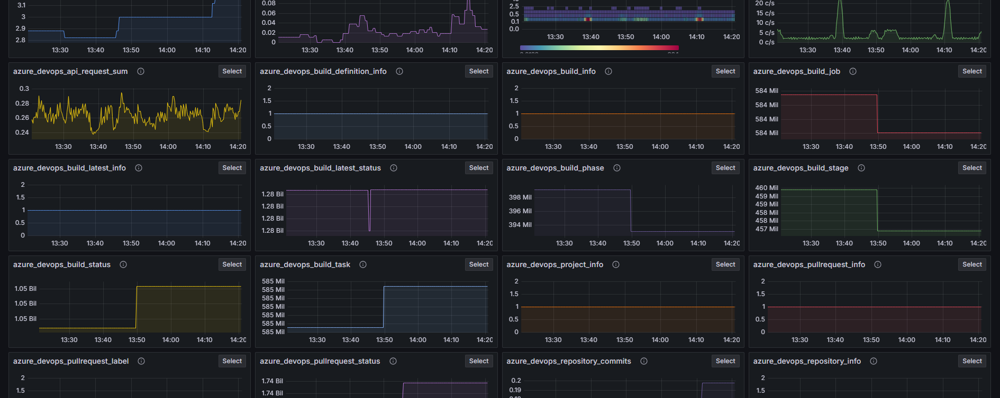

# Grafana

https://grafana.com/

Query, visualize, alert on, and understand your data no matter where it’s stored. With Grafana you can create, explore, and share all of your data through beautiful, flexible dashboards.

* https://play.grafana.org/
* [Grafana fundamentals](https://grafana.com/tutorials/grafana-fundamentals/)
* [Data Source Management](https://grafana.com/docs/grafana/latest/administration/data-source-management/)
* [How to Create Kiosks to Display Dashboards on a TV](https://grafana.com/blog/2019/05/02/grafana-tutorial-how-to-create-kiosks-to-display-dashboards-on-a-tv/)
* [Grafana Plugin Tutorial: Polystat Panel (Part 1)](https://grafana.com/blog/2019/04/02/grafana-plugin-tutorial-polystat-panel-part-1/)
* [Community forum](https://community.grafana.com/)
* Home Assistant
  * [Monitor Home Assistant easily with Grafana](https://grafana.com/solutions/home-assistant/monitor/)
  * [Home Assistant integration for Grafana Cloud](https://grafana.com/docs/grafana-cloud/monitor-infrastructure/integrations/integration-reference/integration-hass/)
* [Grafana video channel](https://vimeo.com/user112284267)
* [Intro to Kubernetes monitoring in Grafana Cloud](https://grafana.com/go/webinar/kubernetes-monitoring-with-grafana-cloud-emea/?src=email&cnt=webinar-invite&camp=kubernetes-monitoring-with-grafana-cloud-final-invite&mkt_tok=MzU2LVlGRy0zODkAAAGZZiP0DHkGW9obtHgCmUIkYsmfHEqwef-tHZ0t5XcArDmuAdShY78J70H5Rg937YG_iIwDCx__oVay5qpeiHXe-QdGw0lW2pjB4yg2dLCBQNGt2A)

## Webinars

1. [How to get started with logging using Grafana Loki](https://grafana.com/go/webinar/getting-started-with-logging-and-grafana-loki-apac/)

## Explore capabilities

1. Metrics (../explore/metrics/trail) use to see graphs from a particular data source

1. Regex format field name
  1. [Extract a substring from field name](https://community.grafana.com/t/extract-a-substring-from-field-name/75882)
  1. [How to limit tooltip output?](https://community.grafana.com/t/how-to-limit-tooltip-output/75466/4)
  1. https://us1.discourse-cdn.com/grafana/original/3X/0/a/0ab56bacfe9e2d679ec415092a0d823e336b8cf1.gif
  1. [How to replace underscores with spaces using a regex in Javascript](https://stackoverflow.com/questions/5356133/how-to-replace-underscores-with-spaces-using-a-regex-in-javascript)